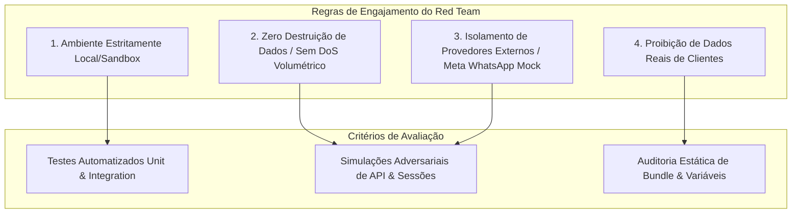

# MATRIZ DE GOVERNANÇA ADVERSARIAL & REGRAS DE ENGAJAMENTO DO RED TEAM (PRE-MERGE)
**DE:** VP STRATEGY & INTELLIGENCE  
**PARA:** AI CENTRAL (COMMANDER) & VP ENGINEERING  
**DATA:** 16 de Agosto de 2026  
**PROJETO:** Mary Esmalteria Web App  
**BRANCH ALVO:** `security/hardening-20260816` (Commit `e9472d2`)  
**CLASSIFICAÇÃO:** CONFIDENCIAL / AUDITORIA ADVERSARIAL PRÉ-MERGE  
**STATUS:** DIRETRIZES DE GOVERNANÇA E CRITÉRIOS DE ACEITE APROVADOS

---

## 1. OBJETIVO E ESCOPO DA AUDITORIA ADVERSARIAL

Esta missão de **Red Team Controlado** tem por finalidade testar de forma hostil e rigorosa as defesas implementadas no commit `e9472d2` da branch `security/hardening-20260816`, antes da sua consolidação na branch `main`.

A validação foca nos vetores mais críticos de risco para a Mary Esmalteria:
1. **Privacidade e Proteção de Dados (LGPD)**: Tentativas de exfiltração, bypass de mascaramento de telefone e apropriação indevida da carteira de clientes.
2. **Controle de Acesso e Autorização**: Tentativas de IDOR, BOLA, escalonamento de privilégios (*Privilege Escalation*) e bypass de permissões individuais.
3. **Criptografia e Sessões**: Tentativas de forjamento de tokens HMAC, sequestro de sessão e ataques de dicionário/timing em senhas e OTP.
4. **Vazamento de Informações**: Inspeção de bundles, headers HTTP, DevTools e mensagens de erro do backend.

---

## 2. REGRAS DE ENGAJAMENTO (RULES OF ENGAGEMENT - RoE)

Para garantir a integridade do ecossistema, os testes adversariais devem seguir rigorosamente os seguintes limites:



1. **Ambiente Autorizado**: Execução restrita ao ambiente local de desenvolvimento/testes (`localhost:3000` / `127.0.0.1` / fixtures de teste em memória).
2. **Zero Negação de Serviço**: Proibidos testes de carga destrutivos que causem exaustão de recursos físicos ou corrupção de arquivos do workspace.
3. **Isolamento de Terceiros**: Não realizar disparos reais via WhatsApp Cloud API para números de telefone externos; todas as validações de OTP e lembretes devem utilizar emuladores de fetch / fixtures controladas.
4. **Proteção de Dados Reais**: Utilizar exclusivamente dados sintéticos e fixtures controladas.

---

## 3. MATRIZ DE CENÁRIOS DE ATAQUE SIMULADO & VETORES AUDITADOS

| ID | Cenário Adversarial | Vetor Técnico Simulado | Mecanismo de Defesa Avaliado | Expectativa de Bloqueio (Critério de Sucesso) |
| :--- | :--- | :--- | :--- | :--- |
| **ADV-01** | Extração de Telefones via DevTools/API | Colaborador faz `GET /api/appointments` e `GET /api/clients` | Middleware `canViewClientPhone` e máscara `maskPhone` | Telefone retornado como `'Telefone protegido 🔒'`. Telefone real não existe no JSON. |
| **ADV-02** | Corrupção de Telefone via Placeholder | Colaborador envia `PUT /api/clients/:id` com `{ phone: "Telefone protegido 🔒" }` | Função `isProtectedPhone` no backend | O backend ignora a alteração do telefone e preserva o número original no banco. |
| **ADV-03** | Vazamento de Telefone via Elementos DOM | Inspecionar atributos `href` de WhatsApp ou tooltips no HTML | Helpers `isPhoneProtected` e supressão de botões na UI | Botões de WhatsApp e tags `<a href>` são completamente omitidos do DOM. |
| **ADV-04** | Forjamento de Papel (Role Forgery) | Injetar `role: "owner"` ou `is_owner: true` no payload de requisições | Sessão criptografada `mary_session` via cookie HttpOnly | `req.auth` deriva exclusivamente do HMAC da sessão; parâmetros injetados são ignorados. |
| **ADV-05** | Bypass de Admin Não-Proprietário | Admin sem autorização tenta ler telefones com a trava ativada | Checagem de `allow_admins_view_client_phone` e `authorized_phone_viewer_ids` | Acesso bloqueado e telefone mascarado, salvo se listado explicitamente nos IDs autorizados. |
| **ADV-06** | IDOR em Histórico de Cliente | Cliente A requisita `/api/clients/appointments?phone=B` | Sessão de cliente amarrando query SQL ao `req.auth.phone` | O backend descarta o parâmetro externo e filtra apenas os registros do `req.auth.phone`. |
| **ADV-07** | BOLA na Edição de Perfil de Manicure | Manicure A envia `PUT /api/professionals/:idB` | Checagem `req.auth.role === 'admin' || req.auth.id === id` | Retorno `403 Forbidden` imediato. |
| **ADV-08** | Falsificação de Tokens de Lembrete | Atacante forja token `v2.<exp>.<sig>` para cancelar agendamento alheio | Validação HMAC-SHA256 em `verifyAppointmentToken` | Falha na verificação de assinatura com `crypto.timingSafeEqual` e retorno `400/403`. |
| **ADV-09** | Força Bruta em Códigos OTP | Disparar requisições em massa para `/api/client-auth/verify-code` | Rate limit por IP + Stored Procedure com teto de 5 tentativas | Bloqueio por `429 Too Many Requests` ou invalidação definitiva do código após 5 erros. |
| **ADV-10** | Cross-Site Request Forgery (CSRF) | Origem externa envia POST/PUT com cookies da sessão | Middleware `requireSameOrigin` e `Sec-Fetch-Site: cross-site` | Retorno `403 Origem da solicitação não permitida.` |
| **ADV-11** | Exposição de Segredos no Bundle Frontend | Análise estática dos arquivos compilados em `dist/` | Build Vite e isolamento de env vars | Zero menções a `SUPABASE_SECRET_KEY`, `SESSION_SECRET` ou credenciais privadas no frontend. |
| **ADV-12** | Vazamento de Stack Traces em Erros SQL | Envio de JSONs malformados ou tipos inválidos | Tratamento centralizado de erros da API | Mensagens de erro padronizadas e semânticas, sem rastros de tabelas internas ou stack traces. |

---

## 4. CRITÉRIOS DE ACEITE E POLÍTICA DE TOLERÂNCIA ZERO (ZERO-TOLERANCE POLICY)

```
+-----------------------------------------------------------------------------------+
|                        POLÍTICA DE ACEITE PRÉ-MERGE                                |
|                                                                                   |
|  [ CRITICAL ] -> ZERO TOLERANCE (1 falha = REJEIÇÃO IMEDIATA DO MERGE)            |
|  [ HIGH ]     -> ZERO TOLERANCE (1 falha = REJEIÇÃO IMEDIATA DO MERGE)            |
|  [ MEDIUM ]   -> REQUER CORREÇÃO OU MITIGAÇÃO COMPROVADA ANTES DO MERGE           |
|  [ LOW ]      -> REGISTRO NO BACKLOG DE MANUTENÇÃO (NÃO BLOQUEANTE)               |
+-----------------------------------------------------------------------------------+
```

### Critérios Formais de Aprovação Pré-Merge:
1. **Zero Vulnerabilidades Abertas**: 0 falhas CRITICAL, 0 falhas HIGH e 0 falhas MEDIUM na matriz adversarial.
2. **Suíte de Testes 100% Verde**:
   - Backend: 48/48 testes passando (`node --test`).
   - Frontend: 44/44 testes passando (`node --test src/tests/agenda.test.js src/tests/privacy.test.js`).
3. **Build e Lint Limpos**:
   - ESLint: 0 erros e 0 avisos.
   - Vite Build: compilação de produção executada com sucesso.
4. **Conformidade LGPD Comprovada**: Prova empírica de que nenhuma requisição de colaborador recebe o telefone real em respostas JSON quando a proteção estiver ativa.

---

## 5. PARECER ESTRATÉGICO CONCLUSIVO

A branch `security/hardening-20260816` (commit `e9472d2`) apresenta uma arquitetura defensiva sólida, com controles em múltiplas camadas (headers, rate limit, CSRF protection, hashing criptográfico `scrypt`, HMAC com domain separation, máscara de dados LGPD e isolamento SQL).

**Parecer do VP Strategy & Intelligence**:
- **GOVERNANÇA**: APROVADA.
- **REGRAS DE ENGAJAMENTO**: ESTABELECIDAS.
- **CRITÉRIOS DE ACEITE**: DEFINIDOS COM POLÍTICA DE TOLERÂNCIA ZERO.
- **STATUS DE LIBERAÇÃO**: AUTORIZADA A EXECUÇÃO DAS SIMULAÇÕES ADVERSARIAIS PELA ENGENHARIA.
