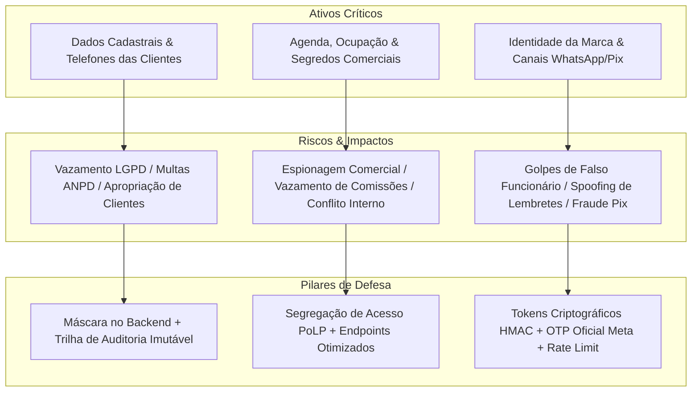
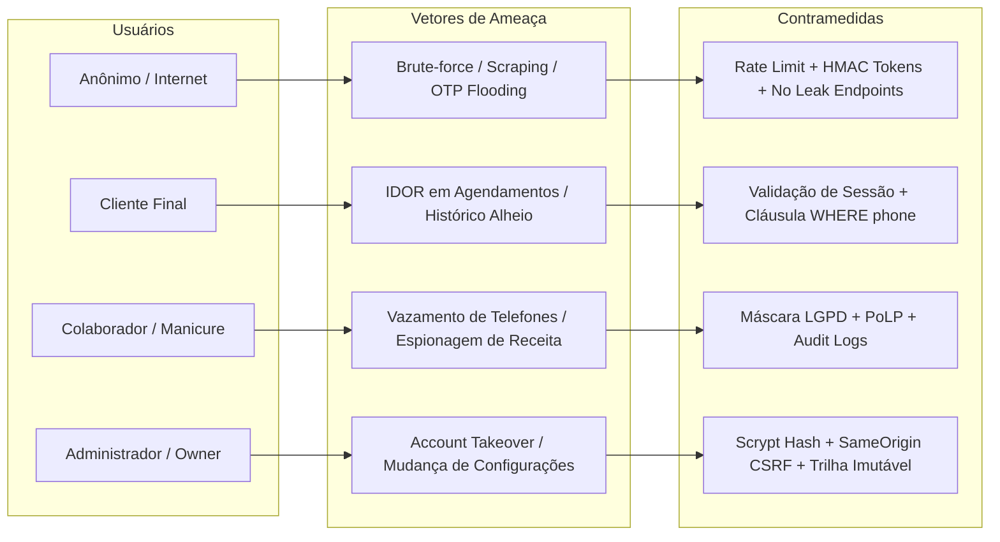

# PARECER ESTRATÉGICO DE SEGURANÇA & THREAT MODEL — MARY ESMALTERIA
**DE:** VP STRATEGY & INTELLIGENCE  
**PARA:** AI CENTRAL (COMMANDER) & VP ENGINEERING  
**DATA:** 16 de Agosto de 2026  
**PROJETO:** Mary Esmalteria Web App  
**CLASSIFICAÇÃO:** CONFIDENCIAL / DIRETRIZ ESTRATÉGICA DE SEGURANÇA  
**STATUS:** APROVADO PARA ENGENHARIA (SECURITY HARDENING FASE 1)

---

## 1. SUMÁRIO EXECUTIVO

A Mary Esmalteria está em fase final de preparação para lançamento em ambiente produtivo. Este documento estabelece o **alinhamento estratégico de segurança, privacidade de dados (LGPD) e governança da informação**, definindo a avaliação de impacto nos ativos críticos, a matriz de ameaças por perfil de usuário (Threat Model) e as diretrizes arquiteturais para a Engenharia.

A premissa fundamental de produto é: **Segurança e Privacidade não são barreiras de fricção, mas diferenciais competitivos que protegem o valor da marca, a confiança das clientes e o faturamento do negócio.**

---

## 2. AVALIAÇÃO DE IMPACTO ESTRATÉGICO, REPUTACIONAL E REGULATÓRIO (LGPD)

### 2.1 Ativo 1: Dados Cadastrais e Telefones de Clientes (Privacidade Estrita)
- **Natureza do Ativo**: A carteira de clientes é o principal patrimônio econômico da Mary Esmalteria. O número de telefone celular/WhatsApp constitui dado pessoal direto segundo a LGPD (Lei 13.709/2018).
- **Impacto Regulatório (LGPD)**:
  - O compartilhamento irrestrito de telefones viola os princípios da **Finalidade** (Art. 6º, I) e da **Necessidade/Minimização** (Art. 6º, III), pois colaboradoras de atendimento não necessitam do telefone real para executar os procedimentos de manicure e pedicure agendados.
  - Sanções administrativas da ANPD (Art. 52) preveem multas de até 2% do faturamento ou R$ 50 milhões por infração, além do dever legal de comunicar incidentes de segurança às titulares e à autoridade nacional.
- **Impacto Estratégico e Reputacional**:
  - A apropriação indevida da base de clientes por colaboradores que se desligam do salão resulta em perda imediata de faturamento (churn direto).
  - O envio de mensagens não solicitadas ou abordagens invasivas fora do canal oficial degrada o posicionamento *premium* da esmalteria e quebra o vínculo de confiança.
- **Diretriz de Segurança**:
  - O backend é a fonte única da verdade: quando a proteção estiver ativada, o telefone real é substituído por `'Telefone protegido 🔒'` antes da serialização JSON.
  - Acesso irrestrito restrito à Proprietária (`owner`) e usuários com ID/Username explicitamente listados em `authorized_phone_viewer_ids`.
  - Supressão total de botões de WhatsApp, discagem e cópia no frontend para sessões não autorizadas.

### 2.2 Ativo 2: Agenda e Segredos Comerciais de Receita / Atendimento
- **Natureza do Ativo**: A base de agendamentos consolida dados de faturamento em tempo real, ticket médio por colaboradora, percentuais de comissão, clientes mais recorrentes e taxas de no-show.
- **Impacto Estratégico e Concorrencial**:
  - A exposição pública da agenda ou acesso de concorrentes permite mapear os dias mais lucrativos, profissionais mais requisitadas e estratégias de precificação.
  - O acesso não autorizado de colaboradores aos relatórios financeiros de colegas gera atritos salariais, disputas internas de comissão e insatisfação no time.
- **Diretriz de Segurança**:
  - Princípio do Menor Privilégio (PoLP): colaboradores acessam estritamente seus próprios agendamentos e sua comissão individual.
  - Endpoints financeiros (`/api/financial/stats`) restritos a administradores e proprietária.
  - Endpoints de disponibilidade pública (`/api/availability` e `/api/availability/next`) retornam apenas vetores de horários ocupados/livres sem expor nomes de clientes, serviços contratados ou valores.

### 2.3 Ativo 3: Integridade da Marca, Prevenção de Fraudes e Anti-Spoofing
- **Natureza do Ativo**: A reputação da Mary Esmalteria e os canais de autoatendimento (links de confirmação no WhatsApp, portal da cliente e recebimentos via Pix).
- **Impacto Reputacional e Operacional**:
  - Se agentes maliciosos puderem cancelar agendamentos de terceiros por enumeração de IDs sequenciais em links de lembrete, o salão sofrerá negação de serviço operacional (cadeiras vazias, clientes insatisfeitas).
  - Golpes em que golpistas se passam pela esmalteria cobrando depósitos antecipados geram danos morais e materiais às clientes.
  - Exaustão da cota de mensagens da API oficial do WhatsApp via ataques de flood.
- **Diretriz de Segurança**:
  - Tokens de confirmação/cancelamento via WhatsApp devem ser assinados criptograficamente (`createAppointmentToken`) com HMAC-SHA256, expiração estrita (TTL) e vinculação unívoca ao ID do agendamento (`v2.compactExpiry.signature`).
  - Rate limiting agressivo em rotas de disparo de OTP e login por IP e número de telefone.
  - Login de cliente baseado em One-Time Password (OTP) de 6 dígitos de alta entropia, com contagem máxima de tentativas (5 tentativas) e cooldown de reenvio.

---

## 3. THREAT MODEL (MODELO DE AMEAÇAS POR PERFIL DE USUÁRIO)

### 3.1 Perfil 1: Usuário Anônimo (Público da Web)
- **Superfície de Ataque**:
  - Endpoints públicos: `/api/services`, `/api/professionals`, `/api/availability`, `/api/client-auth/request-code`, `/api/client-auth/verify-code`, `/api/login`, `/api/appointments/:id/confirm-info`, `/api/appointments/:id/confirm`.
- **Ameaças e Cenários de Risco**:
  1. *Enumeração de Clientes e Telefones*: Tentativa de testar listas de telefones para descobrir clientes frequentes.
  2. *OTP Flooding (Esgotamento de Recursos & Custos)*: Disparar múltiplos códigos OTP para gerar cobranças excessivas na Meta Graph API ou bloquear o serviço.
  3. *Forjamento de Confirmação/Cancelamento*: Modificar parâmetros na URL de lembrete para cancelar agendamentos de outras clientes.
  4. *Força Bruta no Login Administrativo*: Ataque automatizado de dicionário contra credenciais da equipe.
- **Contramedidas Estratégicas**:
  - Rate limiting em memória por IP (`rateLimit`) em rotas de login, OTP e confirmação.
  - Validação criptográfica de tokens (`verifyAppointmentToken`) sem permitir acesso por ID puro.
  - Headers defensivos: `Content-Security-Policy: default-src 'none'`, `X-Frame-Options: DENY`, `X-Content-Type-Options: nosniff`.
  - Tratamento de erros genéricos (respostas sem detalhes internos de banco ou infraestrutura).

---

### 3.2 Perfil 2: Cliente Autenticado (Portal da Cliente)
- **Superfície de Ataque**:
  - Endpoints autenticados com cookie `mary_session` (tipo `client`): `/api/clients/appointments`, `/api/clients/my-history`, `/api/clients/future-appointments`, `/api/appointments`.
- **Ameaças e Cenários de Risco**:
  1. *Insecure Direct Object Reference (IDOR)*: Cliente tenta passar `phone` ou `client_id` de outra pessoa na query/body para visualizar histórico ou cancelar serviços alheios.
  2. *Agendamentos Falsos em Nome de Terceiros*: Criar compromissos em massa para travar a grade da esmalteria.
- **Contramedidas Estratégicas**:
  - A identidade do cliente deriva exclusivamente da sessão validada (`req.auth.phone`). Qualquer parâmetro `phone` vindo do corpo da requisição é ignorado ou validado contra a sessão.
  - Limite de agendamentos simultâneos futuros por cliente e controle de antecedência máxima configurável (`max_advance_days`).
  - Cookies de sessão emitidos com flags `HttpOnly`, `SameSite=Lax` e `Secure` (em produção).

---

### 3.3 Perfil 3: Colaborador (Manicure / Pedicure Autenticada)
- **Superfície de Ataque**:
  - Endpoints autenticados com cookie `mary_session` (tipo `staff`, role `professional`): `/api/appointments`, `/api/clients`, `/api/availability`, `/api/professionals/:id`.
- **Ameaças e Cenários de Risco**:
  1. *Exfiltração de Contatos*: Acesso à lista completa de clientes para salvar números e desviar clientes para atendimento particular.
  2. *Espionagem Financeira e Operacional*: Visualização do total de serviços e receita de outras profissionais da equipe.
  3. *Manipulação de Agendamentos Alheios*: Exclusão ou alteração de agendamentos de outras profissionais.
- **Contramedidas Estratégicas**:
  - Mascaramento mandatório de telefone no backend (`canViewClientPhone` retornando `'Telefone protegido 🔒'`).
  - Supressão de interfaces e links para WhatsApp na UI do colaborador.
  - Escopo restrito na consulta de agendamentos (`?professional_id=me`).
  - Bloqueio rigoroso de endpoints administrativos: `/api/financial/stats`, `/api/settings/audit-logs`, `/api/services` (operações POST/PUT/DELETE) e `/api/professionals` (operações POST/DELETE).

---

### 3.4 Perfil 4: Administrador e Proprietária (Owner)
- **Superfície de Ataque**:
  - Painel Administrativo completo: `/api/settings`, `/api/settings/audit-logs`, `/api/financial/stats`, `/api/professionals`, `/api/services`, `/api/notifications`.
- **Ameaças e Cenários de Risco**:
  1. *Account Takeover (ATO)*: Roubo de sessão ou credenciais do administrador via Cross-Site Scripting (XSS) ou Cross-Site Request Forgery (CSRF).
  2. *Modificação Maliciosa de Parâmetros de Privacidade*: Desativação da proteção de telefone para permitir vazamento de dados.
  3. *Persistência Não Autorizada*: Criação de usuários administrativos fantasmas.
- **Contramedidas Estratégicas**:
  - Hashing de senha com algoritmo `scrypt` derivando chaves com alto custo de memória (`N=16384`, `r=8`, `p=1`).
  - Bloqueio de CSRF via `requireSameOrigin` e validação estrita de cabeçalhos `Sec-Fetch-Site: cross-site`.
  - Trilha de auditoria imutável na tabela `audit_logs` registrando autor (`changed_by_id`, `changed_by_name`), timestamp (`created_at`), configuração alterada (`setting_key`), valor prévio e novo valor.
  - Separação hierárquica clara entre `owner` (acesso total perpétuo) e `admin` operacional.

---

## 4. DIRETRIZES TÉCNICAS CONSOLIDADAS PARA A ENGENHARIA

O VP Strategy & Intelligence orienta que a Engenharia adote as seguintes práticas durante a implementação e validação:

1. **Princípio do Backend como Guardião (No-Trust Frontend)**:
   - A interface pode ocultar elementos visuais, mas o backend **nunca** deve enviar dados sensíveis (telefones protegidos, senhas, faturamentos globais) em respostas JSON para perfis não autorizados.
2. **Defesa em Camadas (Defense-in-Depth)**:
   - Toda rota que recebe escrita deve passar por: (a) Rate Limit, (b) Verificação de Origem/CSRF, (c) Autenticação de Sessão, (d) Autorização de Papel/Role e (e) Sanitização de Dados (`safeText`, `normalizePhone`, `normalizeName`).
3. **Imutabilidade e Não-Repúdio da Auditoria**:
   - Registros de auditoria em `audit_logs` nunca devem ter endpoints de exclusão ou edição (apenas `INSERT` e `SELECT` restrito ao admin/owner).
4. **Resiliência a Timing Attacks**:
   - Comparações criptográficas de tokens, assinaturas de sessão e digests de senha devem utilizar obrigatoriamente `crypto.timingSafeEqual`.
5. **Automação de Testes Contínua**:
   - Toda suíte de segurança (`backend/server.security.test.js`, `backend/privacy.test.js`, `backend/otp.test.js` e `src/tests/privacy.test.js`) deve ser mantida com 100% de aprovação antes de qualquer deploy.

---

## 5. PARECER CONCLUSIVO

A Mary Esmalteria atinge um nível de maturidade de segurança e privacidade superior aos padrões de mercado para plataformas do segmento de beleza e bem-estar. A aplicação das diretrizes deste parecer garante plena conformidade com a LGPD, blinda os segredos comerciais do negócio e protege a reputação da marca perante suas clientes e colaboradoras.

**Aprovação**: Emitido e chancelado pelo **VP Strategy & Intelligence**. Encaminhado à AI Central e ao VP Engineering para execução técnica.
